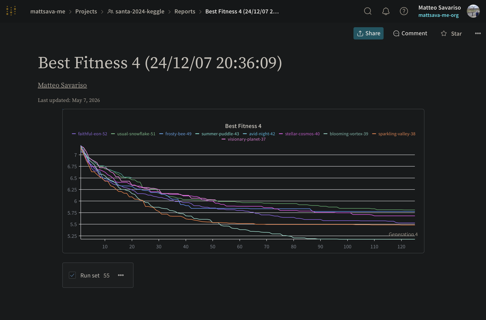

# Genetic Perplexity Optimizer

Optimization project for Kaggle's
[Santa 2024 - The Perplexity Permutation Puzzle](https://www.kaggle.com/competitions/santa-2024).


## Problem

The competition gives bags of holiday-themed words. The goal is to reorder each bag
into a sentence that receives the **lowest possible perplexity** from a fixed reference
language model. Lower perplexity means the model considers the text more natural.

The search space is combinatorial: a 20-word bag has 20! ≈ 2.4 × 10¹⁸ possible
orderings. Exhaustive search is intractable; good heuristics are necessary.

## Approach

This repository implements a **genetic algorithm** for the permutation search:

- Each candidate sentence is a *genome*: one valid permutation of the input words
- Fitness is **negative cross-entropy loss** computed by running the genome through a
  causal language model — no gradient, pure inference
- Population is maintained with **elitism** (top-k always survive) and **tournament
  selection**
- New candidates are generated via **duplicate-safe ordered crossover**: the child
  preserves a slice from parent 1 and fills the rest from parent 2 using a `Counter`
  to respect word multiplicity
- **Adaptive mutation pressure**: swap rate increases when population entropy or
  positional diversity drops below threshold, preventing premature convergence
- Large-scale runs execute on **Modal with an H100**, loading Gemma-2-9B from a
  persistent volume to avoid repeated downloads
- Experiment tracking and hyperparameter sweeps via **Weights & Biases**

## Results

Best public leaderboard score: **~350 perplexity** on the competition evaluation set.

Fitness convergence across 55 W&B runs (lower = better, y-axis is negative log-loss):

[](https://wandb.ai/mattsava-me/santa-2024-keggle/reports/Best-Fitness-4-24-12-07-20-36-09---VmlldzoxMDUwNDUwMw)

Key hyperparameters from the best run:

| Parameter | Value |
|---|---|
| Population size | 150 |
| Elite ratio | 0.10 |
| Generations | 125 |
| Mutation rate (base) | 0.60 |
| Tournament size | 8 |
| Batch size (perplexity eval) | 256 |

## Project Layout

```
genetic/
  enhanced_genome.py   genetic optimizer: genome, batched perplexity scoring,
                       crossover, mutation, diversity metrics
  main.py              experiment entrypoint: loads data, model, tokenizer,
                       runs optimizer, writes Kaggle submission
  utils.py             device config, model path, seed
  config.yaml          W&B Bayesian sweep configuration
scripts/
  download_gemma.py    downloads Gemma-2-9B into a Modal persistent volume
  train_modal.py       launches the optimizer on Modal GPU infrastructure
data.dvc               DVC pointer for Kaggle input files
```

## Setup

Requires Python 3.11+ and [uv](https://github.com/astral-sh/uv).

```bash
uv sync --locked
```

Restore DVC-managed data (requires a configured remote):

```bash
uv run dvc pull
```

## Running Locally

Set `MODEL_NAME` in `genetic/utils.py` to your local model path, then:

```bash
uv run python -m genetic.main
```

The default path (`/modal/google/gemma-2-9b/`) targets the Modal volume used during
competition runs. For local execution with a Hugging Face download:

```python
MODEL_NAME = "google/gemma-2-9b"
```

## Running on Modal

Create the required Modal secrets:

- `huggingface-secret` with `HF_TOKEN`
- `wandb-secret` for experiment tracking

Download the model into the Modal volume:

```bash
uv run modal run scripts/download_gemma.py
```

Launch the optimization job:

```bash
uv run modal run scripts/train_modal.py
```

## Hyperparameter Sweep

A Bayesian sweep over population size, elite ratio, mutation rate, tournament size,
max age, and number of generations is configured in `genetic/config.yaml`. Run it
with:

```bash
uv run wandb sweep genetic/config.yaml
uv run wandb agent <sweep-id>
```

## Data Versioning

The `data/` directory is managed by DVC. The repository stores only the checksum in
`data.dvc`; raw files are excluded from Git via `.gitignore`.

```bash
uv run dvc status
uv run dvc add data
```
